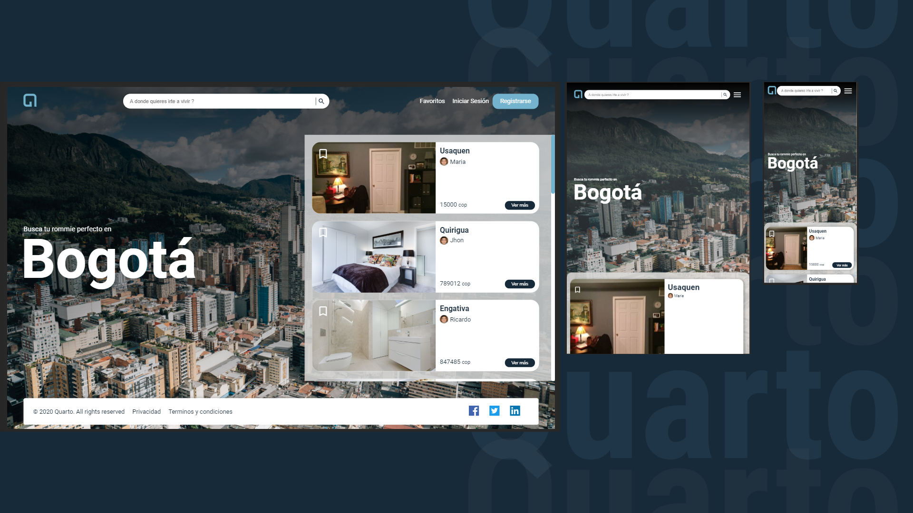

# **Quarto Project**



Quarto Is a Market Place where you can find the perfect room for you. Or if you have an empty room you can find the perfect roomie in your city.

## 📎Links
🎉 **Website**: https://quartoproject.github.io/frontend/

👀 **Documentation**: https://www.notion.so/Quarto-a0863af1a9b443a2920aabc224c6f175

## Instalation 
```
npm install
```

## Run the Project
```
npm start
```

## Tecnologies

* React
* Sass
* Webpack
* React-Testing-Library

## Authors

* Miguel Martelo [@MigueMartelo31](https://twitter.com/MigueMartelo31)
* Mario Restrepo [@maoacr](https://twitter.com/maoacr)
* Beto Toro [@BetoToro_dev](https://twitter.com/BetoToro_dev)
* Anthony Luque [TonyLuque](https://github.com/TonyLuque)
* Jorge Salgado [JasoSalgado](https://github.com/JasoSalgado)

### ¡Thanks for whatching our work!🙏🏼
Feel free of contribute, and keep ot touch 😊
